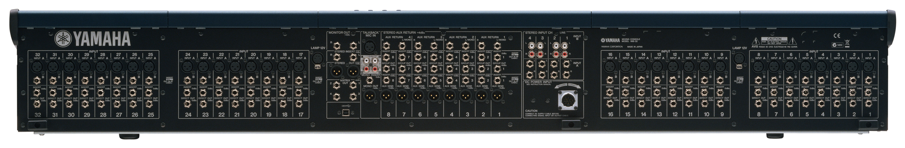

# 교회음향 시스템 선택 & Equipment List

## 믹서

교회에는 무조건 적으로 디지털 콘솔을 추천하는 편입니다.

* 각 예배마다, 찬양팀 마다 별도의 메모리 세팅의 편리함.
* 아웃보드들이 많이 내장되어 있기 때문에. 설치의 스피디함과 배선을 깔끔함.
* 그로인해 문제가 생겼을 때 훨씬 더 쉽게 파악할 수 있다는 장점도 있고요 
* 게다가 라이브 레코딩을 할때도. 디지털 전송으로 더욱 깔끔하게 진행을 할 수가 있습니다. 

## **Current Mixer**

### Yamaha IM8-32 Mixing Console

## **Suggsted Digital Mixer**

* Behringer X32
* MIDAS M32

## Cable Soldering

* Multi Cable: Canare
* Mic Cable: Mogami
* Connectors: Neutrik
* **Put shrink tube before soldering the cables!!**

## Monitor Speaker

* HK Audio Premium PR:O 12M

## **Cables**

* [TRS-TRS](http://www.mogamicable.com/category/products/gold-TRS-TRS_3_6_10_20.php)
* [TRS-XLRF](http://www.mogamicable.com/category/products/gold-TRS-XLRF-3_6_10_15_20_25.php)
* [TRS-XLRM](http://www.mogamicable.com/category/products/gold-TRS-XLRM-3_6_10_15_20.php)

[Cable Buying Guide](https://www.sweetwater.com/insync/cable-buying-guide/)

[TRS vs. TS](https://homestudiobasics.com/trs-vs-ts-cable-differences/)

## **Equipment List**

* Snake StageBox
* PROEL DIRECT100P
* MACKIE 402VLZ4
* Behringer Ultralink PRO MX882
* Behringer POWERPLAY PM1 Personal In-Ear Monitor Beltpack
* Rolls PM351 Personal Monitor Station
* Rolls PM50s Personal Monitor Amplifier
* Behringer Ultra-Di Di20 Professional Active 2-Channel Di-Box/Splitter
* rolls HE18 Hum Eliminator
* rolls PS16 Pm Series Power Center
* ART PowerMIX III Stereo Line Mixer
* Feedback ReducerBehringer Feedback Destroyer Pro DSP1124P
* Behringer FBQ1000 Feedback Destroyer
* SHARK FBQ100 Automatic Feedback Destroyer
* Livewire SPDI Passive Direct Box with Attenuation Pad
* Behringer ULTRA-DI DI100 Direct Box
* Art ARTcessories Zdirect Professional Passive Direct Box
* Camcorder: Sony HDR-FX1

## DI \(**Direct**\) ****Box

* Link line: Keep distance short as possible \(under 5m or 15ft\)
* On: -16 or -20 & Unity Gain
* Ground or Lift: 노이즈가안나는쪽으로설정
* Output Line: Good up to 600m
* Passive DI: Acoustic Guitar & Keyboard
* When used with Keyboard: 
  * Select `-20dB` switch
  * Else: -40dB

### DI Box 추천

| Model | Price | Note |
| :--- | :--- | :--- |
|  Radial SB2PASSIVE |  $69.99 |  Passive DI |
|  On Stage DB500 |  $29.95 |  |
|  Whirlwind IMP 2 |  $49.99 |  Amazon |
|  Behringer Ultra-DI DI400P |  $19.99 |  Amazon |

