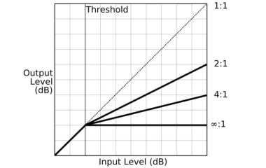

# FGBC Audio Mixing

## 1. 정확한 "레벨세팅"

마스터 페이더를 중간으로 내려놓게되면 음질적인 손실 뿐만 아니라 그만큼 콘솔의 입력 게인을 많이 올려야 되기 때문에, 이로인해서 각 마이크에 다른 소리가 섞어서 들어오는 간섭음도 심해지며 하울링의 가장 큰 원인이 되기도 합니다.

1. **각 채널의 이퀄라이저나 인서트로 들어가 있는 아웃보드는 모두 바이패스를 시킨다.**  
2. **콘솔의 마스터 페이더를 디자인 센터\(0\)에 놓고 절대\(!!\)로 움직이지 않는다.**
   * **믹서에 있어서음질열화가 가장 적은 "순수한" 포지션입니다.**  
3. **채널 페이더도 디자인센터에 두고.**  
4. **다음으로 게인조정을 음악에 기준이 되는 악기\(킥드럼등.\)들을 올려가며 모든 음악이 나오는 피크점에서 콘솔의 마스터미터가 피크게 가깝게 되도록 "게인"을 조정한다.**

### Note

각 채널페이더의 게인조정은, 모든 악기들이 나오는 가장 큰 지점에서 콘솔의 마스터미터가 거의 피크에 가깝게 나오도록 만드는 것이 게인조정의 "핵심".

그리고 나서의 "음악적인 밸런스"는 각 채널 페이더로 미세조정을 합니다. \(때에따라서는 음악에 따라 채널페이더를 만지면서 게인노브를 조금씩 수정을 하게 되는 경우도 있을 수 있습니다. \)

#### 믹서의 피크가 0db까지만 있을 때의 경우:

* 일반적으로 킥드럼 채널을 마스터미터에서 -**5db 정도**되게 맞추어 둡니다.
* 채널 페이더를 올렸을때. 마스터 페이더에서 -5db 정도가 되는 것이 좋다.

####  **믹서의 피크가 +10db인 믹서의 경우:**

* **+5db**를 **기준**으로 잡고 믹싱을 시작.
  * 채널 페이더를 올렸을때. 마스터 페이더에서 **+5db 정도**가 되는 것이 좋다.
* 음악의 가장 큰 부분에서 **+10까지** 믹서의 **헤드룸을 꽉 채워서 사용하게 됩니다.**
* 각 채널 페이더는 O 포지션 근처에만.

### Example

24트랙의 4밴드\(드럼.베이스.기타.보컬\)의 음악을 믹싱한다고 할 때**:**

* 맨처음 먼저 킥드럼의 음량을 -5db정도로 맞추어 놓고 믹싱을 시작하면. 
* 나중에 모든 트랙의 악기들이 페이더에 올라갔을 때. 최종적으로 0db에 가깝게 됩니다. 
* 그렇기 때문에 영자는 여기서 -5db라는 수치를 이야기 한 것입니다. 

**먼저, 믹서의 헤드룸을 충분히 사용한 다음에,** 

**파워앰프의 전원을 켜거나 파워앰프의 음량 노브를 조절하는 것은 바로 이 다음입니다.** 

**위와 같이 조정된 상태에서 파워앰프의 볼륨을 켜고, 자신의 귀로 현재 공간과 시스템상의 최대볼륨을 조정합니다.** 

## **2. 이퀄라이저 & 컴프레서 조절**

어떠한 주파를 6db이상 부스트할 일이 생기면 -&gt; "메인스피커의 튜닝을 다시합니다." 

메인 스피커 튜닝이 잘 되어있다면 무리하게 특정주파수를 부스트하는 일은 거의 필요가 없습니다. 

* **EQ를 플랫으로 바꾸고 -&gt;**
* **그 다음 불필요한 주파수를 부스트해서 찾아나간 후 -&gt;**
* **그 주파수만 Q값을 좁게해서 예리하게 커트.**

드럼부터 보컬까지 각 악기의 이러한 불필요한 주파수\(대부분 소리를 흐리게 만드는 것은 저역이 많습니다.\)를 커트하는 것 만으로도 소리는 훨씬 더 깨끗해지는 것을 알 수 있었습니다. 

## **3. Compressor Setting**

**과감하게 약 8:1정도의 높은 비율과  하드한 컴프레싱으로 레벨 정리.**

**컴프레싱은 "음색의 변화가 크게 느껴지지 않는 수준에서 하드하게" 사용**

| Ratio | Description \(Threshold : Reduction\) |
| :--- | :--- |
| 1:1 | Lowest. Represents “unity gain”. \(No attenuation\) |
| 2:1 | Signal exceeding threshold by 2dB will be attenuated down to 1 dB above the threshold |
| 3:1 | Moderate compression |
| 5:1 | Medium compression |
| 8:1 | Strong compression |
| 20:1 ~ ∞:1 | "Limiting" by most. Can be used to ensure that a signal does not exceed the amplitude of the threshold. |

마스터채널에 컴프레서 세팅을 했는데. 콘솔의 컴프레서 창을 보니 **게인리덕션이 움직이지 않고 있어도 컴프레서가 동작하고 있다**. 컴프레서 "IN"버튼을 누른것과 그렇지 않은 것이 이렇게 차이가 난다.

### Suggested Setting

Threshold Knob \(제일왼쪽에있는것\): OFF \(그냥왼쪽으로\)  
Ratio Knob: 12시방향  
Output Gain Knob: 0 \(12시방향\)  
Peak Stop Limiter Knob: \(+10\) 12시방향







[How to Use Compression - Behind The Mixer](https://www.behindthemixer.com/how-use-compression/)

[The Most Important EQ Techniques for Church Sound](https://collaborateworship.com/eq-church-sound/)

[https://collaborateworship.com/eq-church-sound/](https://collaborateworship.com/eq-church-sound/)

## **4. 모니터 세팅**

모니터 스피커도 메인 사운드처럼 조절한 소리가 나야되는데 각 채널의 이퀄라이저나 컴프레서가 걸린 소리가 전혀 모니터스피커로 전달이 되고 있지 않다.

**Aux Output을 "Post \(AFL\)"로 설정.**

* **Aux Sends are mostly monitored AFL.**

**PFL: Pre-Fade Listen  
AFL: After-Fade Listen = Post-Fade Listen**

[How to Use Aux Sends for Monitor Mixes](https://collaborateworship.com/aux-sends-monitor-mixes/)

## **5. 순차전원**

* 켜는순서: 믹서기, EQ등 -&gt; 앰프
* 끄는순서: 앰프 -&gt; 믹서기

## Suggested Settings

High-Pass Filter\(√80 or √100\):

* On for All Vocals or Anything that isn’t a bass instrument \(i.e. Kick Drum, or Bass Guitar\)
* Off for Kick Drum or Bass Guitar

Filter out all frequencies below 80 Hz.

* Lets high frequencies pass, while blocking low frequencies.

## **EQ Setting**

**Graphic EqualizerEQ Bypass: OFF**

**Low Cut: OFF**

\*\*\*\*

**EQ Setting**

소리가 많이 벙벙하다고 느낄때 150~200hz

소리가 뭉쳐진 느낌이나고, 먹먹할때 250~300hz

지나친 Fullness로 배부른 꽉 찬소리에,  많이 뭉친 느낌이 날때 400~500h

소리가 ****뻑뻑하거나 딱딱한 느낌이 나고 시원스럽지 못할때 600~800hz

전화기혹은라디오소리마냥목소리가꺼끌꺼끌하고, 비음섞인듯한소리가심할때 1.6~3kz

소리가 날카롭고, 따갑다고 느낄때 4khz~6khz

고산지대에 노래하는 마냥 숨차고, 에어감이 부족하며 호흡에 여음이 없을때 8khz~10khz

어둡고 탁한지하실에서 부르는느낌이 많이날때 10~15khz

## **Aux Send \(Stage Monitor\): Mono vs. Stereo**

Aux 1 - PC Recording

Aux 2 ~ Aux 6: Empty

Aux 7 - Sub Speaker Out

Aux 8 - Sub Speaker Out

## Reference





\*\*\*\*

